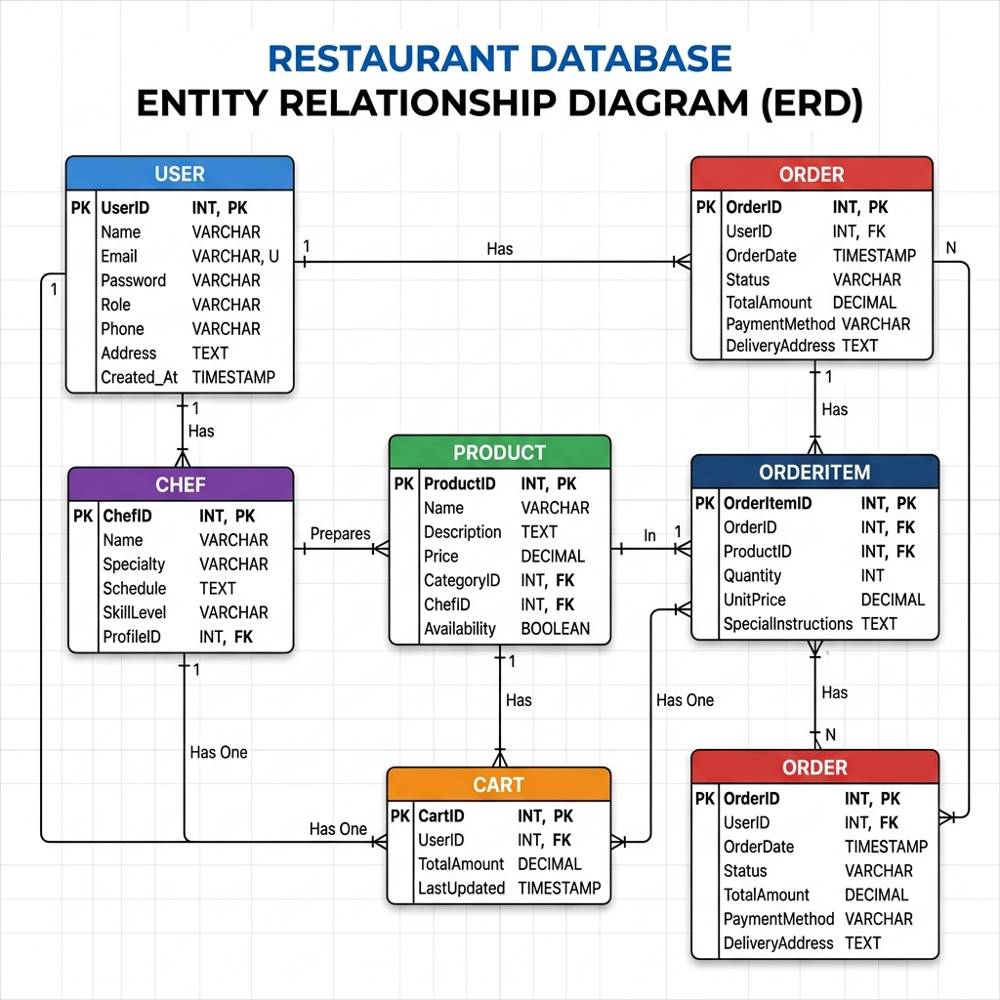

# 🍽️ MidwayCafe — Laravel Restaurant E-Commerce System

  <b>Full-Stack Restaurant Ordering Platform built with Laravel, PHP, Blade, and PostgreSQL</b>

  A backend-focused project designed to understand real Laravel application flow, MVC structure,
  Blade rendering, authentication, database relationships, and payment workflow integration.

---

## 📌 Problem Statement

Traditional restaurant workflows often depend on manual ordering, offline reservations, poor order tracking, and scattered admin operations.

Many restaurant web applications only implement basic CRUD features, but they do not clearly demonstrate how a real backend system handles authentication, routing, middleware, database relationships, checkout flow, and admin control.

MidwayCafe solves this by providing a structured Laravel-based restaurant commerce system with a clean MVC architecture and server-side Blade rendering.

---

## 🎯 Proposed Solution

MidwayCafe is designed as a centralized restaurant e-commerce platform that supports customer ordering, cart management, reservation handling, payment processing, and admin-side management.

The solution focuses on building a maintainable Laravel application where each layer has a clear responsibility:

- **Routes** handle request entry points
- **Middleware** protects secure areas
- **Controllers** manage request logic
- **Models** interact with the database
- **Blade views** render dynamic pages
- **Database tables** store structured business data

---

## 🖼️ System Architecture

  

---

## 🗄️ Database Schema

  

---

## 🧠 Why This Solution Structure?

This structure was selected because Laravel naturally supports scalable web application development through MVC.

The goal was not only to build a restaurant project, but to understand how professional Laravel applications are organized internally.

### Why Laravel?

Laravel was chosen because it provides:

- Clean MVC architecture
- Built-in routing system
- Middleware support
- Eloquent ORM
- Authentication support
- Migration-based database management
- Secure session handling
- Easy integration with payment services

### Why Blade?

Blade was used instead of a heavy frontend framework because the project focuses mainly on PHP backend development and Laravel server-side rendering.

Blade helps in:

- Creating reusable layouts
- Rendering dynamic pages
- Keeping frontend closely connected with Laravel data
- Reducing unnecessary frontend complexity
- Understanding server-rendered application flow

---

## ⚙️ Core Features

- User Authentication
- Role-Based Authorization
- Restaurant Menu Management
- Cart Management
- Checkout Workflow
- Order Processing
- Reservation Management
- Coupon Handling
- Rating System
- Admin Dashboard
- Payment Gateway Integration

---

## 🏗️ Application Architecture

MidwayCafe follows Laravel’s MVC architecture.

### Models

Models represent database entities and handle data interaction using Eloquent ORM.

Examples:

- User
- Product
- Order
- Cart
- Reservation
- Coupon
- Rating

### Views

Views are built using Blade templates. They are responsible for rendering dynamic UI pages using data received from controllers.

### Controllers

Controllers process incoming requests, apply business logic, communicate with models, and return appropriate responses.

### Middleware

Middleware is used to protect routes, validate authentication, and control role-based access.

---

## 🛠️ Technology Stack

### Backend

- PHP 8
- Laravel 9

### Frontend

- Blade Template Engine
- Bootstrap
- Tailwind CSS
- JavaScript

### Database

- PostgreSQL

### Authentication

- Laravel Jetstream
- OTP Verification

### Payment Integration

- bKash
- SSLCommerz

---

## 📂 Project Focus

This project mainly focuses on:

- PHP backend development
- Laravel request lifecycle
- Blade-based page rendering
- MVC separation
- Database relationship handling
- Authentication and authorization flow
- Admin and customer workflow separation
- Payment and checkout flow understanding

---

## 🚀 Setup Instructions

For installation and execution steps, refer to:

- [RUN.md](RUN.md)

---

## 📄 Additional Documentation

- [Project Features](Project_Features.md)

---

## 👨‍💻 Author

**Shivshankar Mali**  
📧 shivashankrmali7@gmail.com

---

  <b>MidwayCafe</b> demonstrates how a common restaurant domain can be engineered with clean Laravel architecture, structured backend logic, and professional PHP development practices.

