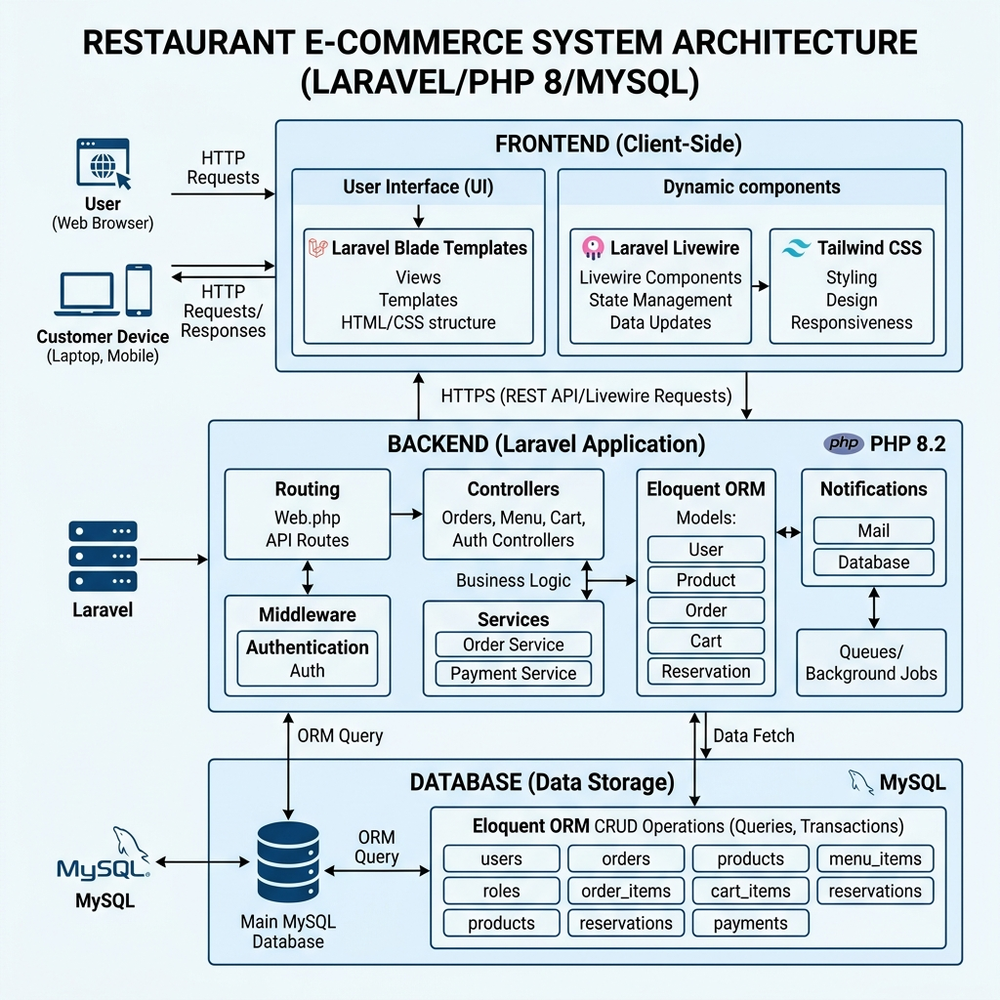

<div align="center">

# 🍽️ MidwayCafe  
### Laravel Restaurant E-Commerce System

<b>PHP • Laravel • Blade • PostgreSQL • Payment Workflow</b>

<br>



<br><br>

A professional Laravel-based restaurant ordering platform built to understand  
<b>MVC architecture, Blade rendering, authentication flow, checkout handling, and backend structure.</b>

</div>

---

## 📌 Problem Statement

Traditional restaurant operations often face problems such as manual ordering, slow reservation handling, weak order tracking, and scattered admin management.

Many restaurant web projects only show basic CRUD operations. They do not clearly explain how a real Laravel application handles routing, middleware, controllers, authentication, Blade views, database interaction, and checkout flow.

---

## 🎯 Proposed Solution

<b>MidwayCafe</b> provides a centralized restaurant commerce system where users can browse menu items, manage cart items, place orders, make reservations, and complete payments through a structured Laravel workflow.

The project is designed to show how a common restaurant domain can be implemented using clean PHP backend logic and Laravel MVC architecture.

---

## 🧠 Why This Structure?

<table>
<tr>
<td width="50%">

### Why Laravel?

Laravel was selected because it provides a clean and scalable backend structure with:

- MVC architecture
- Routing system
- Middleware protection
- Eloquent ORM
- Authentication support
- Migration-based database handling

</td>
<td width="50%">

### Why Blade?

Blade was used because it keeps the frontend tightly connected with Laravel and helps build server-rendered pages without unnecessary frontend complexity.

It improves understanding of:

- Layout inheritance
- Reusable components
- Dynamic page rendering
- Backend-driven UI flow

</td>
</tr>
</table>

---

## ⚙️ Key Features

<table>
<tr>
<td>

✅ User Authentication  
✅ Menu Browsing  
✅ Cart & Checkout  
✅ Order Management  

</td>
<td>

✅ Reservation Handling  
✅ Admin Dashboard  
✅ Role-Based Access  
✅ Payment Integration  

</td>
</tr>
</table>

---

## 🏗️ Laravel Application Flow

```text
User Request
    ↓
Routes
    ↓
Middleware
    ↓
Controller
    ↓
Model / Service Logic
    ↓
Blade View
    ↓
Response
````

This flow helped in understanding how Laravel internally processes a request from browser input to final rendered output.

---

## 🛠️ Technology Stack

<table>
<tr>
<td><b>Backend</b></td>
<td>PHP 8, Laravel 9</td>
</tr>
<tr>
<td><b>Frontend</b></td>
<td>Blade, Bootstrap, Tailwind CSS, JavaScript</td>
</tr>
<tr>
<td><b>Database</b></td>
<td>PostgreSQL</td>
</tr>
<tr>
<td><b>Authentication</b></td>
<td>Laravel Jetstream, OTP Verification</td>
</tr>
<tr>
<td><b>Payments</b></td>
<td>bKash, SSLCommerz</td>
</tr>
</table>

---

## 📂 Project Focus

This project focuses mainly on:

* PHP backend development
* Laravel MVC implementation
* Blade-based server-side rendering
* Authentication and authorization flow
* Checkout and payment workflow
* Admin and customer workflow separation

---

## 🚀 Setup Instructions

<a href="RUN.md"><b>View Setup Guide</b></a>

---

## 📄 Additional Documentation

<a href="Project_Features.md"><b>View Project Features</b></a>

---

<div align="center">

## 👨‍💻 Author

<b>Shivshankar Mali</b>
📧 [shivashankrmali7@gmail.com](mailto:shivashankrmali7@gmail.com)

<br>

<b>MidwayCafe</b> demonstrates how a common restaurant domain can be engineered with clean Laravel architecture, structured PHP backend logic, and professional Blade-based development.

</div>
