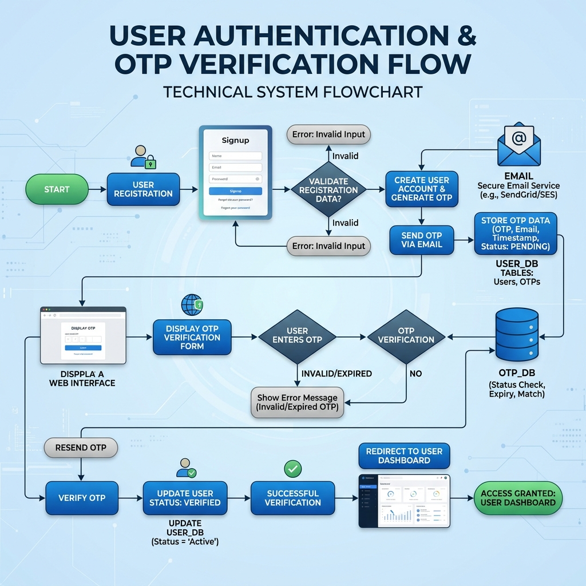

<div align="center">

# 🍽️ MidwayCafe  
### Laravel Restaurant E-Commerce System

<b>PHP • Laravel • Blade • PostgreSQL • Payment Workflow</b>

<br>


<br><br>

A professional Laravel-based restaurant ordering platform focused on understanding  
<b>MVC architecture, Blade rendering, authentication flow, payment workflow, and scalable backend structure.</b>

</div>

---

## 📌 Problem Statement

Traditional restaurant operations often rely on manual workflows, disconnected ordering systems, slow reservation handling, and inefficient admin management.

Most beginner-level restaurant applications only implement CRUD functionality without focusing on:

- backend architecture,
- authentication workflow,
- routing lifecycle,
- middleware handling,
- payment processing,
- and maintainable application structure.

---

## 🎯 Proposed Solution

<b>MidwayCafe</b> provides a centralized restaurant commerce platform where customers can browse menus, manage carts, place orders, complete payments, and track reservations through a structured Laravel workflow.

The project was intentionally designed to focus more on:
- clean backend engineering,
- Laravel lifecycle understanding,
- Blade rendering,
- and MVC-based application organization.

---

<div align="center">

## 🔐 Authentication & Request Workflow



</div>

---

## 🧠 Why This Structure?

<table>
<tr>
<td width="50%">

### Why Laravel?

Laravel was selected because it provides:

- Clean MVC architecture
- Secure authentication system
- Middleware-based route protection
- Structured routing workflow
- Eloquent ORM support
- Scalable backend organization

</td>

<td width="50%">

### Why Blade?

Blade was used to deeply understand Laravel’s server-side rendering workflow while keeping the frontend tightly integrated with backend logic.

It helped in learning:

- Dynamic page rendering
- Layout inheritance
- Reusable UI components
- Backend-driven rendering flow
- Request-to-response lifecycle

</td>
</tr>
</table>

---

## ⚙️ Key Features

<table>
<tr>
<td>

✅ User Authentication  
✅ Menu Browsing  
✅ Cart & Checkout  
✅ Order Management  

</td>

<td>

✅ Reservation Handling  
✅ Admin Dashboard  
✅ Role-Based Access  
✅ Payment Integration  

</td>
</tr>
</table>

---

## 🏗️ Laravel Application Flow

```text
User Request → Routes → Middleware → Controller → Model Logic → Blade View → HTTP Response
```

This project helped in understanding how Laravel internally processes requests from browser input to final rendered output.

---

## 🛠️ Technology Stack

<table>
<tr>
<td><b>Backend</b></td>
<td>PHP 8, Laravel 9</td>
</tr>

<tr>
<td><b>Frontend</b></td>
<td>Blade, Bootstrap, Tailwind CSS, JavaScript</td>
</tr>

<tr>
<td><b>Database</b></td>
<td>PostgreSQL</td>
</tr>

<tr>
<td><b>Authentication</b></td>
<td>Laravel Jetstream, OTP Verification</td>
</tr>

<tr>
<td><b>Payments</b></td>
<td>bKash, SSLCommerz</td>
</tr>
</table>

---

## 📂 Project Focus

This project mainly focuses on:

* PHP backend development
* Laravel MVC implementation
* Blade-based server-side rendering
* Authentication & authorization workflow
* Payment and checkout handling
* Structured Laravel architecture

---

## 🚀 Setup Instructions

<a href="RUN.md"><b>View Setup Guide</b></a>

---

## 📄 Additional Documentation

<a href="Project_Features.md"><b>View Project Features</b></a>

---

<div align="center">

## 👨‍💻 Author

<b>Shivshankar Mali</b>
📧 [shivashankrmali7@gmail.com](mailto:shivashankrmali7@gmail.com)

<br><br>

<b>MidwayCafe</b> demonstrates how a common restaurant domain can be engineered using structured Laravel architecture, professional PHP backend practices, and clean Blade-based rendering workflows.

</div>
